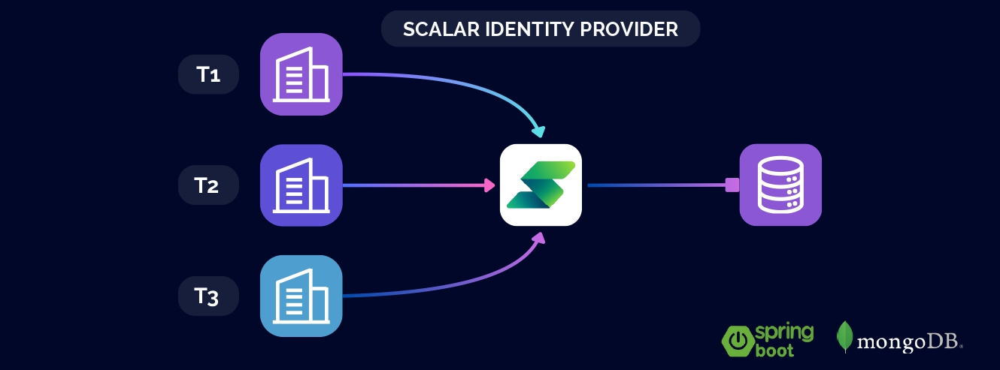

# Scalar Identity Provider

This is a Identity Provider (IdP) for **Scalar** (project documentation at [Scalar Documentation](SCALAR_DOCS.md)). This IdP implements a signup and login flow using JWT (JSON Web Tokens) for authentication services and multitenancy features. It connects to a MongoDB database to manage user roles, user data and tenants.

## List of Contents
- [Features](#features)
- [Requirements](#requirements)
- [Running the Project](#running-the-project)

## Features

- **JWT Authentication**: Secure user authentication using JSON Web Tokens.
- **Multitenancy**: Support for multiple tenants, allowing users to belong to different organizations.
- **Role Management**: Assign and manage user roles within tenants.
- **MongoDB Integration**: Store and manage user and tenant data in a MongoDB database.

## Requirements

To run this project, you will need to set up a MongoDB cluster and configure the application. Follow the steps below:

1. **Create a Free Cloud MongoDB Cluster:**
   - Go to [MongoDB Atlas](https://cloud.mongodb.com/).
   - Create a free cloud cluster.
   - Obtain your MongoDB connection string and replace the placeholder in the `application.properties` file.

2. **Create the Database and Collections:**
   - Create a database for the project (e.g., `mydb`).
   - Inside this database, create two collections: `roles` and `users`.

3. **Insert Initial Documents into the `roles` Collection:**
   - Insert the following documents into the `roles` collection:
     ```json
     {"name":"ROLE_USER"}
     {"name":"ROLE_ADMIN"}
     {"name":"ROLE_MODERATOR"}
     ```

## Running the Project

To run this project, use the following commands in your terminal or command prompt:
```bash
mvn install
mvn spring-boot:run
```